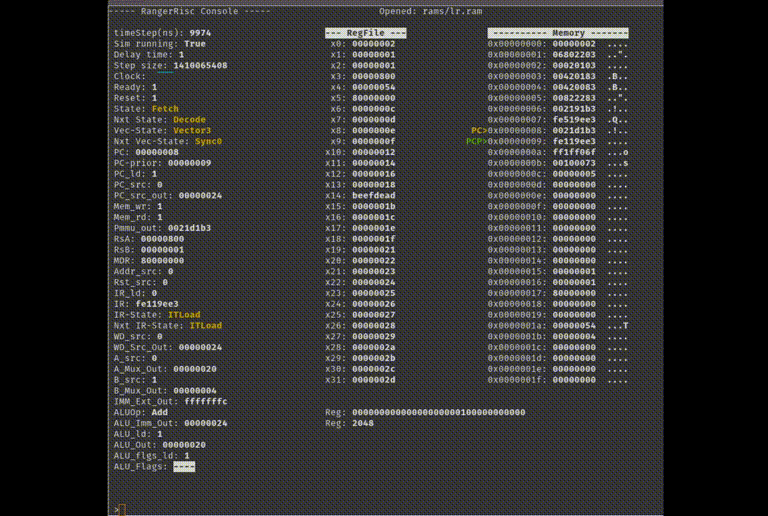
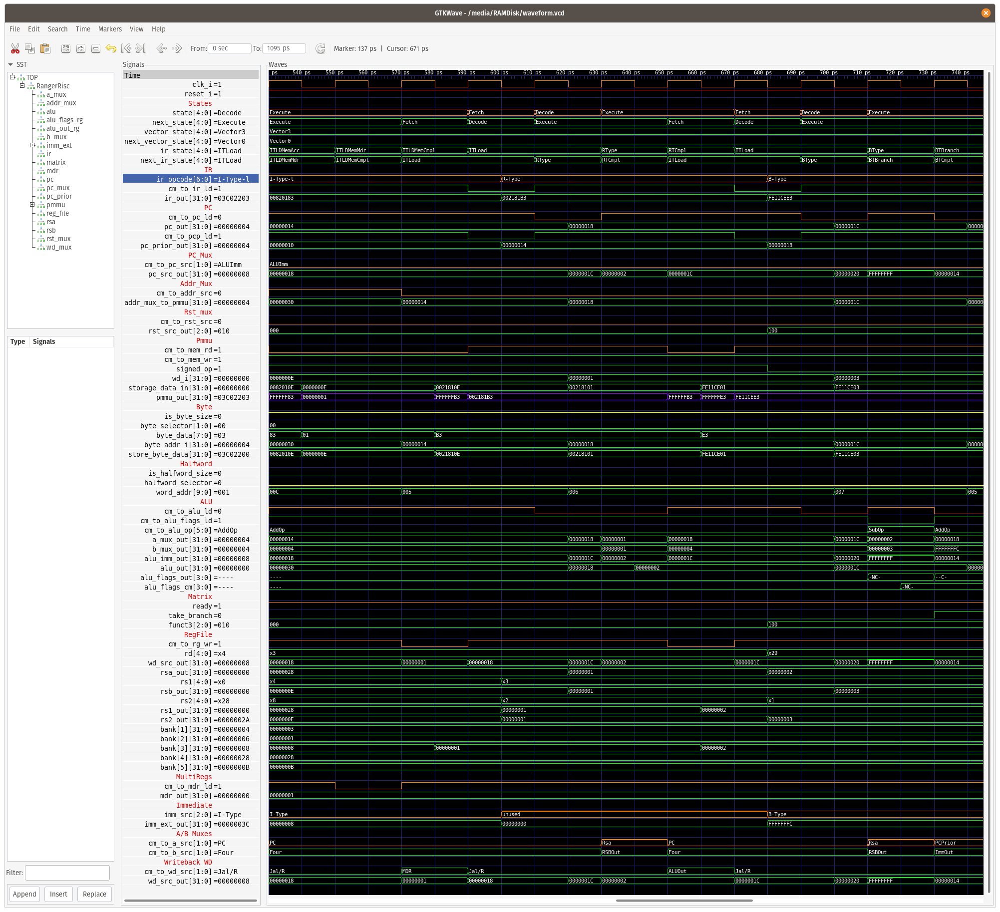
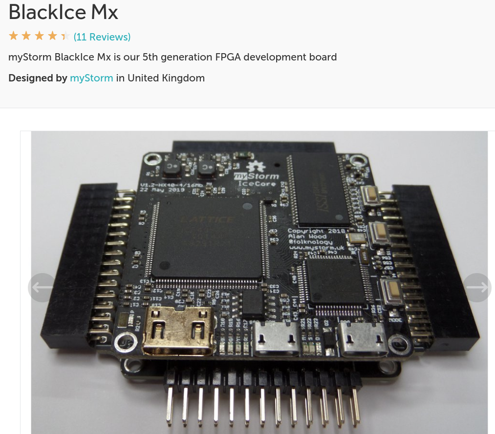

# Ranger Risc (RISC-V-RV32I-MultiCycle)
An intuitive multi-cycle RISC-V RV32I soft-core processor for FPGAs using open source software and Folknology's BlackIce Mx.

This repository represents the **[After Hours Engineering](https://www.youtube.com/channel/UCQxFumV2LMrKBMDW6dar_ZA)** Youtube series.


## Components
    [x] Mux(s)
    [x] Register
    [x] RegisterFile
    [x] ALU
    [x] Immediate
    [x] Memory
    [x] Pmmu
    [x] ControlMatrix

## Simulation
    [x] Mux(s)
    [x] Register
    [x] RegisterFile
    [x] ALU
    [x] Immediate
    [x] Memory
    [x] Pmmu
    [x] Instruction Register
    [x] RangerRisc
    [x] Testbench GtkWave
    [x] Testbench NCurses

# Howto(s)

# RangerRisc Console
Simulating the softcore processor was done two ways: *Gtkwave* and *NCurses console*.

## NCurses console
### Run simulation
- Navigate into the *RISC-V-RV32I-MultiCycle/simulation/ranger_console* directory.
- Modify *memory.sv* ```defines``` to reference your *.ram* file.
   ```
   `define ROM_PATH "rams/"
   `define ROM_EXTENSION ".ram"
   `define MEM_CONTENTS "itype_csrs/intr1"
   ```

- execute "make console"

### Commands the console recognizes
- Hitting "return" repeats the previous command -- if there was one
- **rn** Run to a specific state or instruction, for example
   - rn fetch **or** rn fe
   - rn decode **or** rn de
   - rn execute **or** rn ex
   - rn ebreak **or** rn eb
   - rn pc *word addrs*
      - rn pc 0x10
- **reset** resets simulation
- **sg** Send a (l)ow/(h)igh signal
   - sg reset h
- **ss** Start simulation. Runs N steps before stopping
   - To run for 1000000 steps and then stop
      - ss 1000000
- **h** Halts simulation if running
- **ns** Steps a single unit-step
- **hc** Steps a half clock cycle
- **fl** Steps a full clock cycle
- **delay** enables/disables thread sleep delay
   - delay on
   - delay off
- **dt** Change thread sleep delay time
   - dt delay-number
      - dt 1
      - dt 10
- **srg** Makes a RegFile register active for display in binary and decimal
   - srg 3
- **crg** Change a RegFile value
   - change x3 to 0
      - crg 3
   - change x9 to 0xAA
      - crg 9 0xAA
- **mr** Set starting memory display range *Word-address* format. Default is 0
   - mr 0x040
- **mm** Modify a memory address *Word-address* format.
   - mm 0x4c 0x0000ABCD
- **ld** Load a program from *rams* folder, without *.ram* extension.
   - To load lr.ram
      ld lr
- **pc** Set PC register to a *Word-address*
   - pc 0x04D
- **bra** Break a *Word-address*
   - bra 0xC0
- **br** Break enable/disable
   - br on
   - br off
      - **or** br
- **fr** FreeRun enable/disable
   - fr on
   - fr off
      - **or** fr
- **stp** Stepping enable/disable
   - stp on
   - stp off
      - **or** stp
- **irq** IRQ enable/disable
   - irq on
   - irq off
      - **or** irq
- **irqt** Set trigger point (Units are in unit-step)
   - irqt 0x04D
- **irqd** Set IRQ duration. Default = 3
   - irqd 5



## Gtkwave
### Run simulation
- Navigate into the *RISC-V-RV32I-MultiCycle/simulation/ranger_risc* directory.
- Modify *memory.sv* ```defines``` to reference your *.ram* file.
   ```
   `define ROM_PATH "rams/"
   `define ROM_EXTENSION ".ram"
   `define MEM_CONTENTS "itype_csrs/intr1"
   ```
- execute "make go"

You should now see the Gtkwave output as shown below.



# Synthesis
For synthesis a modification was made to the PMMU to support memory mapped IO.

- Upload softcore
  - and write program to blink onboard LED
  - And button input to trigger interrupt


# Hardware

## Folknology



## DPI
- https://www.doulos.com/knowhow/systemverilog/systemverilog-tutorials/systemverilog-dpi-tutorial/
- https://en.wikipedia.org/wiki/SystemVerilog_DPI
- https://www.youtube.com/watch?v=HhSAnApHYkU

https://www.exploringbinary.com/twos-complement-converter/

# Misc

## Crossing domains 2-FF Synchronizer
- https://electronics.stackexchange.com/questions/237725/how-does-2-ff-synchronizer-ensure-proper-synchonization
- https://www.icdesigntips.com/2020/12/two-ff-synchronizer-explained.html

Tasks:
- Store PC in mepc
- Store mtvec in PC
- Add mem mapped IO and interrupts
- CSRs:
- https://opencores.org/projects/potato/control%20registers
- https://marz.utk.edu/my-courses/cosc562/riscv/ eOS
- https://danielmangum.com/posts/risc-v-bytes-privilege-levels/
- https://book.rvemu.app/hardware-components/03-csrs.html
- https://danielmangum.com/posts/risc-v-bytes-privilege-levels/
- https://bonfirecpu.eu/bonfire_core.html version scheme
- RISCV An Overview of the ISA.pdf
- The RISC-V Reader privileged Arch

- mtvec, Machine Trap Vector, holds the address the processor jumps to when an exception occurs.
- mepc, Machine Exception PC, points to the instruction where the exception occurred.
- mcause, Machine Exception Cause, indicates which exception occurred.
- mie, Machine Interrupt Enable, lists which interrupts the processor can take and which it must ignore.
- mip, Machine Interrupt Pending, lists the interrupts currently pending.
- mtval, Machine Trap Value, holds additional trap information: the faulting address for address exceptions, the instruction itself for illegal instruction exceptions, and zero for other exceptions.
- mscratch, Machine Scratch, holds one word of data for temporary storage.
- mstatus, Machine Status, holds the global interrupt enable, along with a plethora of other state, as Figure 10.4 shows.


Interrupt can be taken if mstatus.MIE=1, mie[N]=1, and mip[N]=1

- mip.MEIP = mip[11] (RO)
- mie.MEIE = mie[11]
- mstatus.MIE = mstatus[3]
- mstatus.MPIE = mstatus[7]

Interrupts pending bits are checked at the end of an instruction (retired).
- Prolog stores state
- Epilog restores state

### Communication
Only one byte is transmitted at a time. Before each Trx the Ownership bits are checked.

## Ownership
- 00 = neither own
- 01 = Console owns
- 10 = Sim owns

### Sim
At the end of each retired instruction the Sim checks ownership bits. Thus the Sim can only transmit if the bits = 00.

### Console

To send data either Console or Sim must grab the mutex first. The one that has the mutex can send data.
The other must poll until the mutex is freed.
PIO.control[0] = mutex
PIO.control[1] = send-ready signal
PIO.control[2] = data-ready signal
PIO.control[3] = data-end signal

-------------------

## Circuit

### UART

BitRate/ClockFrq = (9600/1000000000)/(1000000000/50000000) = 5208.333333333

Ceil(5208.333333333) = 13

and 2^13 = 8192

% difference is: 0.853333333 = 8.5% which is < 10% allowable max.

#### Links
- https://nandland.com/uart-serial-port-module/
- https://www.fpga4fun.com/SerialInterface2.html
- https://www.maximintegrated.com/en/design/technical-documents/tutorials/2/2141.html
- https://community.silabs.com/s/article/baud-rate-accuracy-using-the-hfrco?language=en_US
- https://erg.abdn.ac.uk/users/gorry/eg3576/UART.html
- https://www.sciencedirect.com/topics/engineering/baud-rate
- https://en.wikipedia.org/wiki/Crystal_oscillator_frequencies#:~:text=115200-,UART%20clock%20allows%20integer%20division%20to%20common%20baud%20rates%20up,)%20or%20230%2C400(x8x3).&text=audio-,Used%20in%20CD%2DDA%20systems%20and%20CD%2DROM%20drives%3B,22.05%20kHz%2C%20and%2011.025%20kHz.


##@ async futures
- https://devdreamz.com/question/844791-user-input-without-pausing-code-c-console-application
- https://forum.juce.com/t/async-input-stream/48817/4
- https://www.codeproject.com/Questions/5275669/How-can-I-use-input-without-waiting-user-to-give-s
- https://www.linuxquestions.org/questions/programming-9/how-do-i-watch-for-keyboard-input-without-waiting-in-c-858521/
- http://www.cplusplus.com/forum/general/242502/

Blogs:
- http://jborza.com/

RISC-V usage:
- https://dzone.com/articles/introduction-to-the-risc-v-architecture#:~:text=The%20RISC%2DV%20S%20privilege,a%2012%2Dbit%20page%20offset.
  - LUI example with addi

## Tools
- https://www.digitalelectronicsdeeds.com/index.html
- https://github.com/chipsalliance/UHDM  SystemVerilog to Verilog
- https://www.rapidtables.com/convert/number/decimal-to-hex.html Good calculator

coredumps:
ulimit -c unlimited
gdb /media/RAMDisk/VRangerRisc
   backtrace

## Verilator Errors
### AstNode error
```
AstNode is not of expected type, but instead has type 'TYPEDEF'
  138 | } CSReg /*verilator public*/ ; 
      |   ^~~~~
```
The above error is caused when you incorrectly use your *enum* incorrectly. For example,
```
    case (csrAddr)
        CSReg::Mstatus: regIdx = 0;
```
Leave the XXX:: prefix off:
```
    case (csrAddr)
        Mstatus: regIdx = 0;
```

                // IRQ0: begin
                //     // PC is pointing at the next instruction. Store it
                //     // for mret instruction.
                //     // Mepc <== PC
                //     csr_src = CSRSrcPC;
                    // csr_wr = RWActive;
                //     csradr_src = CMCSRAddr;
                //     csr_addr = Mepc;

                //     next_ir_state = IRQ1;
                // end

# QspiMem

The 4 bit QSPI is halfduplex so the it can write and read over the same wires. I think Din is for when you want to send data back to the STM32

You have to connect up Data in/Out and Address using RD and WR to signal transactions.

This is slice access also used in rust. Basically think of it as accessing members of an array (actually list in python) x[4]  4th element, x[:4] is first 4 elements x[:-4] Last four elements. x[:4]  is shorthand for x[0:4] elements i.e a blanked zero! Take a look here https://amaranth-lang.org/docs/amaranth/latest/lang.html#signals One thing to be careful of is the bit order, it is the opposite way around to Verilog which is very confusing! 

The circuit being controlled does not see qd or qd_oe. They are internal to QspiMem. The qd nibble is what is used to send data between the STM32 and QspiMem.

But the circuit under control does use din, or at least will when we implement reads from the STM32. When rd in asserted it is requesting data, and the circuit under control should ensure that din is set to the value corresponding to addr on the next clock cycle. So it can be used to a read status register at that address or memory at that address. 

So,  when BlackCrab implements the 0x04 command to read data from QspiMem, one thing you might use it for is to read back the value of your softcore rom or ram for diagnostic purposes. To do that the circuit being controlled sets din to the memory address corresponding to addr, whenever rd is asserted.

In amaranth when you set dir="io" on a pin or set of pins in its resource definition, an SB_IO primitive is automatically generated. That separates a port such as qd, into three signals, qd.i, qd.o, and qd,oe. They are passed to QspiMem as qd_i, qd_o, and qd_oe. When you set qd_oe to zero, it sets the qd pins to input and allows you to read the value from qd_i. When you set qd_oe to 1, it sets the qd pins to output and allows you to assign values to qd_o.

The alternative way to do this without SB_IO in Verilog is to use qd directly and set qd to 4'bzzzz when you want the pins to be in input mode. This is called tri-stating the pins, and is not well supported by Yosys. You have to do it in the top-level module. It is better to use SB_IO. You can sets pins to dir="-" in amaranth and use the SB_IO primitive explictly if you want to, but letting it do the automatic thing is easier.

Note that "oe" stands for output enable.

Also, note that the STM32 has to do the corresponding action on the pins in Rust, so that when the HDL sets the qd pins to input, the STM32 must set them to output, and when the HDL sets them to output, the Rust firmware must set them to input. This is done by both ends using the same QspiMem protocol and knowing which direction data is flowing at any point.

- https://stackoverflow.com/questions/60957971/understanding-the-sb-io-primitive-in-lattice-ice40

To make a tristate inout you can't just declare inout signal at the top-level module, you need fpga-specific primitive.

Most FPGA specific IO primitives implement it by having a PACKAGE_PIN which points to top-level inout signal and OUTPUT ENABLE signal.
- Input signal is always valid (D_IN_0) and represents the value of PACKAGE_PIN,
- while D_OUT_0 is connected in hardware by tristate buffer to the PACKAGE_PIN so when OUTPUT ENABLE is 1 and driving it Hi-Z when OUTPUT ENABLE is 0.

## Comment
It could be replaced with the following generic Verilog, repeated 4 times from 0 to 4.
```
assign flash_io0 = flash_io0_oe ? flash_io0_do : 1'bz;
assign flash_io0_di = flash_io0;
```