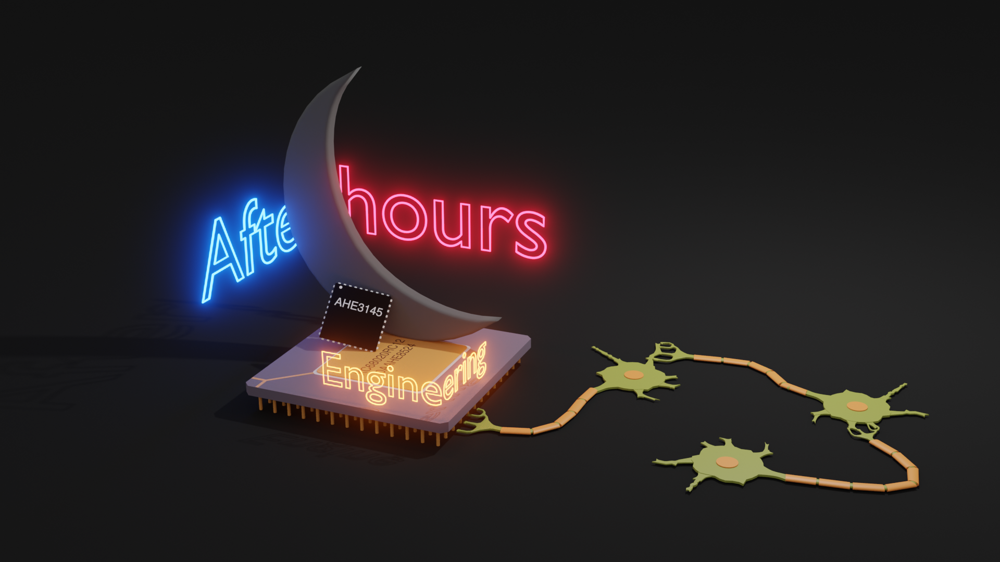

# Ranger Risc (RISC-V-RV32I-MultiCycle)
An intuitive multi-cycle RISC-V RV32I soft-core processor for FPGAs using open source software and Folknology's BlackIce Mx.

This repository represents the **[After Hours Engineering](https://www.youtube.com/channel/UCQxFumV2LMrKBMDW6dar_ZA)** Youtube series.



## Components
    [x] Mux(s)
    [x] Register
    [x] RegisterFile
    [x] ALU
    [x] Immediate
    [x] Memory
    [x] Pmmu
    [x] ControlMatrix

## Simulation
    [x] Mux(s)
    [x] Register
    [x] RegisterFile
    [x] ALU
    [x] Immediate
    [x] Memory
    [x] Pmmu
    [x] Instruction Register
    [x] RangerRisc
    [x] Testbench GtkWave
    [x] Testbench NCurses


# RangerRisc Console
Simulating the softcore processor was done two ways: *Gtkwave* and *NCurses console*.

## NCurses console


## Gtkwave


# Hardware

## Folknology


## DPI
- https://www.doulos.com/knowhow/systemverilog/systemverilog-tutorials/systemverilog-dpi-tutorial/
- https://en.wikipedia.org/wiki/SystemVerilog_DPI
- https://www.youtube.com/watch?v=HhSAnApHYkU

https://www.exploringbinary.com/twos-complement-converter/

## Misc

Tasks:
- Store PC in mepc
- Store mtvec in PC
- Add mem mapped IO and interrupts
- CSRs:
- https://opencores.org/projects/potato/control%20registers
- https://marz.utk.edu/my-courses/cosc562/riscv/ eOS
- https://danielmangum.com/posts/risc-v-bytes-privilege-levels/
- https://book.rvemu.app/hardware-components/03-csrs.html
- https://danielmangum.com/posts/risc-v-bytes-privilege-levels/
- https://bonfirecpu.eu/bonfire_core.html version scheme
- RISCV An Overview of the ISA.pdf
- The RISC-V Reader privileged Arch

- mtvec, Machine Trap Vector, holds the address the processor jumps to when an exception occurs.
- mepc, Machine Exception PC, points to the instruction where the exception occurred.
- mcause, Machine Exception Cause, indicates which exception occurred.
- mie, Machine Interrupt Enable, lists which interrupts the processor can take and which it must ignore.
- mip, Machine Interrupt Pending, lists the interrupts currently pending.
- mtval, Machine Trap Value, holds additional trap information: the faulting address for address exceptions, the instruction itself for illegal instruction exceptions, and zero for other exceptions.
- mscratch, Machine Scratch, holds one word of data for temporary storage.
- mstatus, Machine Status, holds the global interrupt enable, along with a plethora of other state, as Figure 10.4 shows.


Interrupt can be taken if mstatus.MIE=1, mie[N]=1, and mip[N]=1

- mip.MEIP = mip[11] (RO)
- mie.MEIE = mie[11]
- mstatus.MIE = mstatus[3]
- mstatus.MPIE = mstatus[7]

Interrupts pending bits are checked at the end of an instruction (retired).
- Prolog stores state
- Epilog restores state

### Communication
Only one byte is transmitted at a time. Before each Trx the Ownership bits are checked.

## Ownership
- 00 = neither own
- 01 = Console owns
- 10 = Sim owns

### Sim
At the end of each retired instruction the Sim checks ownership bits. Thus the Sim can only transmit if the bits = 00.

### Console

To send data either Console or Sim must grab the semaphore first. The one that has the semaphore can send data.
The other must poll until the semaphore is freed.
PIO.control[0] = semaphore
PIO.control[1] = send-ready signal
PIO.control[2] = data-ready signal
PIO.control[3] = data-end signal

-------------------

## Circuit

UART as a blackbox


## UART or PIO
This requires a plain testbench that interacts solely with a terminal

async futures
- https://devdreamz.com/question/844791-user-input-without-pausing-code-c-console-application
- https://forum.juce.com/t/async-input-stream/48817/4
- https://www.codeproject.com/Questions/5275669/How-can-I-use-input-without-waiting-user-to-give-s
- https://www.linuxquestions.org/questions/programming-9/how-do-i-watch-for-keyboard-input-without-waiting-in-c-858521/
- http://www.cplusplus.com/forum/general/242502/

Blogs:
- http://jborza.com/

RISC-V usage:
- https://dzone.com/articles/introduction-to-the-risc-v-architecture#:~:text=The%20RISC%2DV%20S%20privilege,a%2012%2Dbit%20page%20offset.
  - LUI example with addi

## Tools
- https://www.digitalelectronicsdeeds.com/index.html
- https://github.com/chipsalliance/UHDM  SystemVerilog to Verilog
- https://www.rapidtables.com/convert/number/decimal-to-hex.html Good calculator

coredumps:
ulimit -c unlimited
gdb /media/RAMDisk/VRangerRisc
   backtrace

## Verilator Errors
### AstNode error
```
AstNode is not of expected type, but instead has type 'TYPEDEF'
  138 | } CSReg /*verilator public*/ ; 
      |   ^~~~~
```
The above error is caused when you incorrectly use your *enum* incorrectly. For example,
```
    case (csrAddr)
        CSReg::Mstatus: regIdx = 0;
```
Leave the XXX:: prefix off:
```
    case (csrAddr)
        Mstatus: regIdx = 0;
```

                // IRQ0: begin
                //     // PC is pointing at the next instruction. Store it
                //     // for mret instruction.
                //     // Mepc <== PC
                //     csr_src = CSRSrcPC;
                    // csr_wr = RWActive;
                //     csradr_src = CMCSRAddr;
                //     csr_addr = Mepc;

                //     next_ir_state = IRQ1;
                // end
