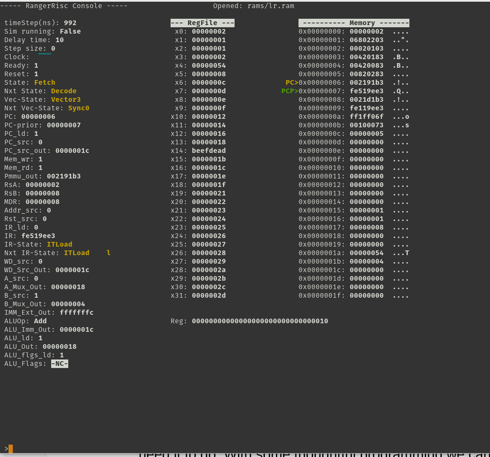

# Ranger Risc (RISC-V-RV32I-MultiCycle)
An intuitive multi-cycle RISC-V RV32I soft-core processor for FPGAs using open source software and Folknology's BlackIce Mx.

## Folknology

## Components
- [x] Mux(s)
- [x] Register
- [x] RegisterFile
- [x] ALU
- [x] Immediate
- [x] Memory
- [x] Pmmu
- [x] ControlMatrix

## Simulation
- [x] Mux(s)
- [x] Register
- [x] RegisterFile
- [x] ALU
- [x] Immediate
- [x] Memory
- [x] Pmmu
- [x] Instruction Register
- [x] RangerRisc

This repository represents the **After Hours Engineering** Youtube series.

# RangerRisc Console
Simulating the softcore processor was done two ways: *Gtkwave* and *NCurses console*.

## NCurses console

## Gtkwave

## DPI
- https://www.doulos.com/knowhow/systemverilog/systemverilog-tutorials/systemverilog-dpi-tutorial/
- https://en.wikipedia.org/wiki/SystemVerilog_DPI
- https://www.youtube.com/watch?v=HhSAnApHYkU

https://www.exploringbinary.com/twos-complement-converter/
